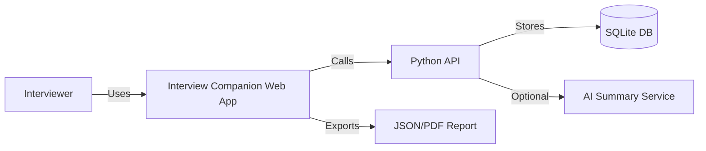
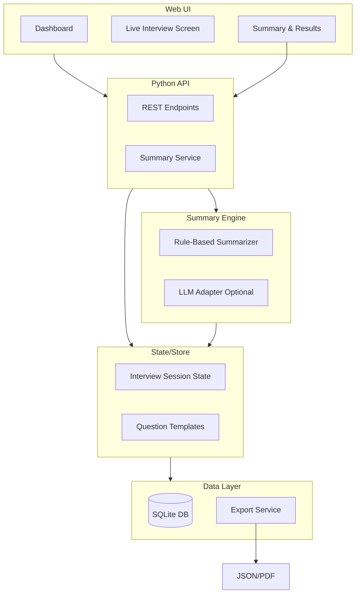
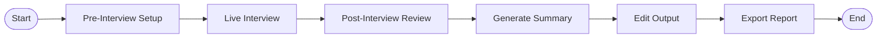
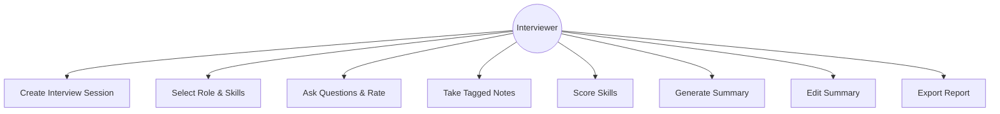
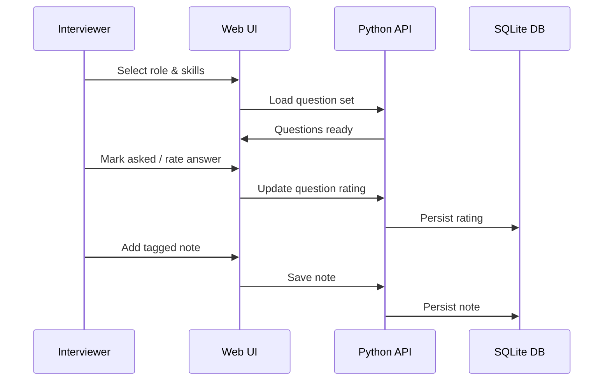
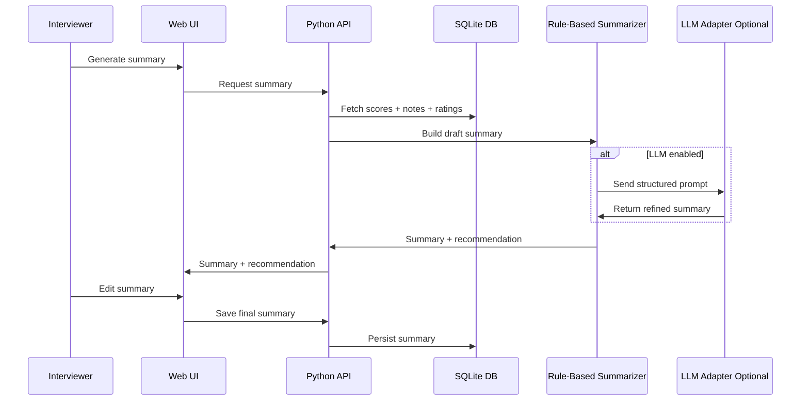
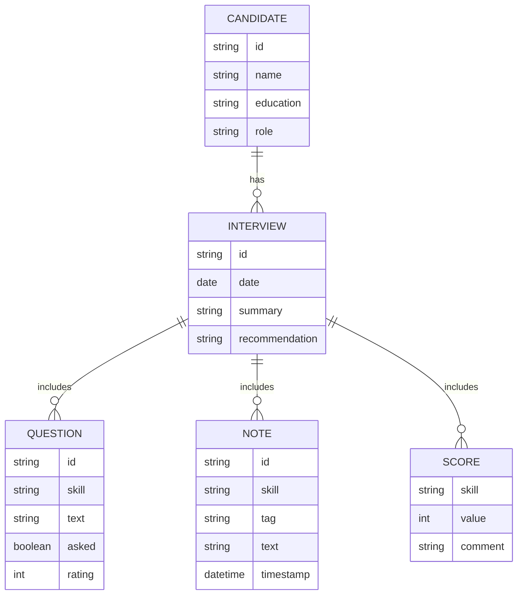

# Architecture

## 1) Overview
A lightweight, web-based application optimized for live interview usage. MVP targets a single interviewer on a single device with a Flask API, SQLite storage, and SQLAlchemy ORM. The frontend is HTML/CSS/JS and the system is containerized with Docker for consistent setup and portability.

## 2) High-Level Diagram (Logical)
- UI (Dashboard, Live Interview, Summary)
- API (Flask service)
- Data Layer (SQLite + SQLAlchemy + export)
- Optional AI Summary Service (stubbed or local rules)

## 3) Frontend Architecture
- Pages
  - Dashboard
  - Live Interview
  - Summary & Results
- UI Modules
  - QuestionList
  - NotePanel
  - SkillScoreTable
  - SummaryEditor
  - ExportPanel
- State Model
  - Candidate
  - Interview
  - Questions
  - Notes
  - Scores

## 4) Data Flow
1. Load role template → question list
2. Capture candidate profile → create interview session (API + SQLite)
3. During interview: update question states, add notes, update scores (API + SQLite)
4. Post-interview: generate summary (rules or AI)
5. Export report (API)

## 5) Storage Strategy (MVP)
- SQLite database (file-based)
- Export JSON (optionally PDF)
- Docker volume for persistence

## 6) Summary Generation
- Rule-based fallback (deterministic)
- Optional LLM adapter interface (future)

## 7) Security & Privacy
- No PII beyond interview data
- No external upload by default
- Explicit consent for transcript text

## 8) Scalability & Future
- Replace SQLite with managed DB for multi-user deployment
- Multi-interviewer support
- Audit trail and rubric customization
- Separate UI and API containers

## 9) Diagrams (Mermaid)

### 9.1 System Context

### 9.2 Container/Component View

### 9.3 User Flow

### 9.4 Use Case Diagram

### 9.5 Sequence Diagram: Live Interview

### 9.6 Sequence Diagram: Summary Generation

### 9.7 Data Model (ER)

